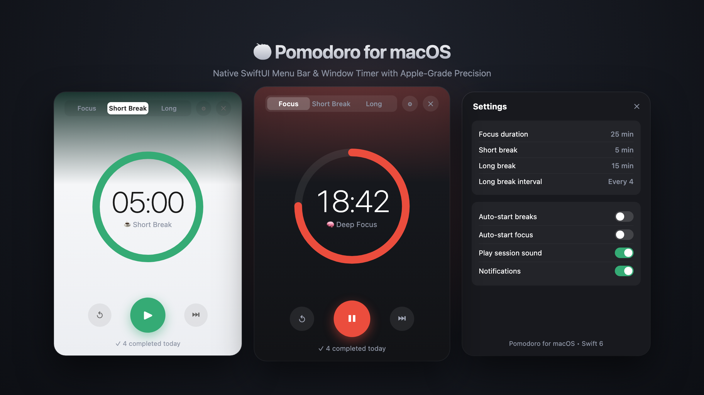
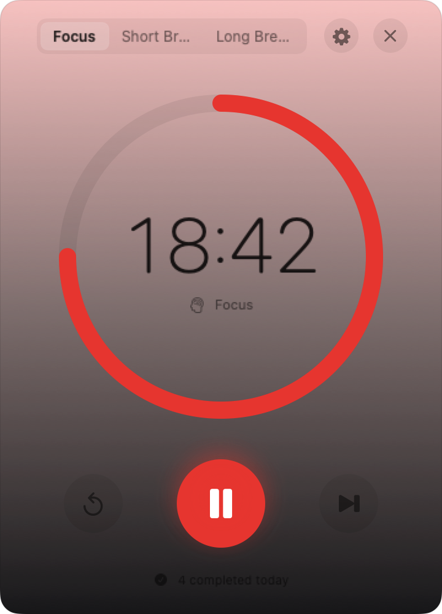
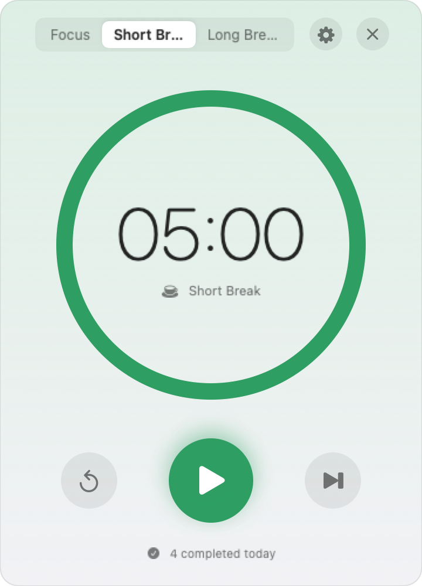
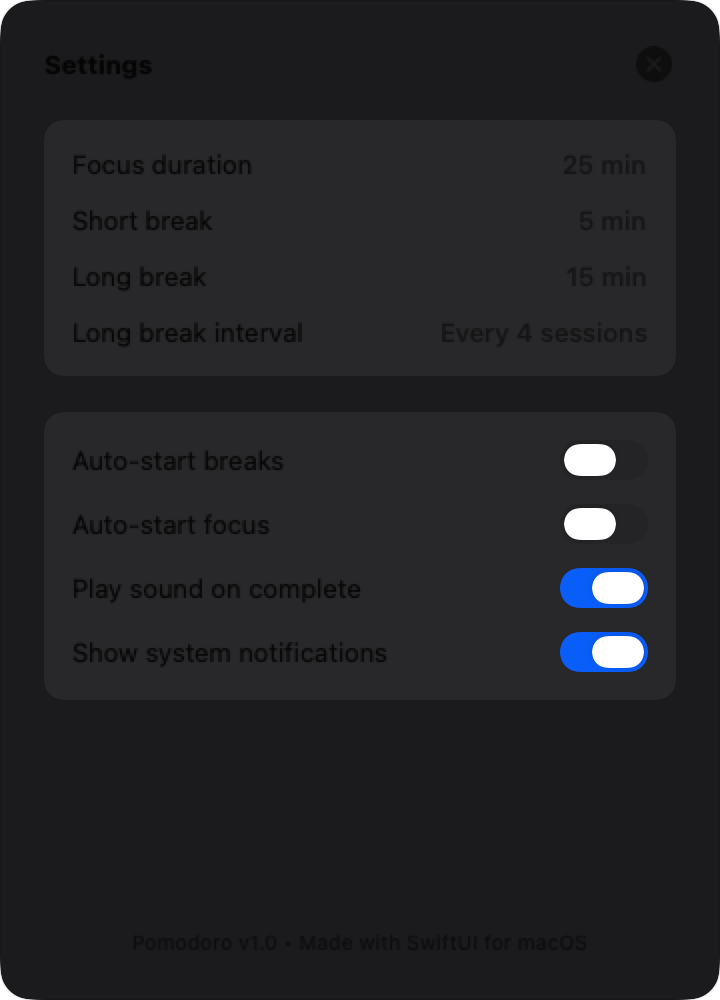

# 🍅 Pomodoro for macOS

<p align="center">
  
</p>

<p align="center">
  
  
  
  
</p>

A native, lightweight macOS Pomodoro timer crafted with **SwiftUI** and **AppKit**. Designed with Apple-grade polish — featuring an animated circular progress ring, monospaced typography, smooth mode transitions, custom session settings, and a live menu bar countdown.

---

## ✨ Features

- 🎯 **3 Work/Rest Modes**:
  - **Focus** (25 min) — Vibrant tomato red accent
  - **Short Break** (5 min) — Refreshing emerald green accent
  - **Long Break** (15 min) — Calm ocean blue accent
- ⏱️ **Live Menu Bar Countdown**: Keep an eye on your progress from the status bar even when the main timer window is closed.
- 🎨 **Apple Design Polish**: Native rounded typography (`monospacedDigit`), fluid ring animations, custom glassmorphic window backgrounds, and dark/light mode support.
- ⚙️ **Comprehensive Preferences**:
  - Configurable Focus, Short Break, and Long Break durations
  - Long break intervals (e.g. every 4 completed sessions)
  - Auto-start breaks / auto-start focus sessions
  - System notification and sound alert toggles
- 📊 **Daily Session Tracker**: Automatically counts and persists your completed focus sessions.
- ⌨️ **Keyboard Shortcuts & Quick Controls**: Start, pause, reset, skip, or close (`⌘W`) with seamless window lifecycle handling.

---

## 📸 Screenshots

<p align="center">
  
  
  
</p>

---

## 🚀 Getting Started

### Requirements
- macOS 14.0 (Sonoma) or later
- Xcode 15+ / Swift 6+ toolchain

### Build the `.app` bundle

```sh
# Clone the repository
git clone https://github.com/pepedesigner/Pomodoro.git
cd Pomodoro

# Build release binary and assemble build/Pomodoro.app
./Scripts/make_app.sh

# Launch the app
open build/Pomodoro.app
```

### Run with Swift CLI (Development)

```sh
swift run
```

---

## 🛠️ Project Structure

```
Pomodoro/
├── Sources/
│   └── Pomodoro/
│       ├── PomodoroApp.swift       # App entrypoint & menu bar status item setup
│       ├── ContentView.swift       # Main circular timer UI & controls
│       ├── MenuBarView.swift       # Menu bar dropdown status view
│       ├── SettingsView.swift      # Preferences & customization sheet
│       ├── TimerModel.swift        # State machine, timer engine & persistence
│       └── WindowAccessor.swift    # AppKit NSWindow styling bridge
├── Resources/
│   └── Info.plist                  # macOS application metadata
├── Scripts/
│   ├── make_app.sh                 # Release build & app bundle packager
│   └── generate_icon.swift         # Dynamic app icon generator
└── screenshots/                    # High-res UI preview screenshots
```

---

## 📄 License

MIT License © [pepedesigner](https://github.com/pepedesigner)
